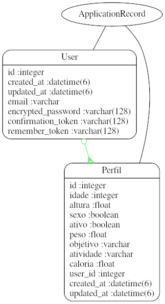
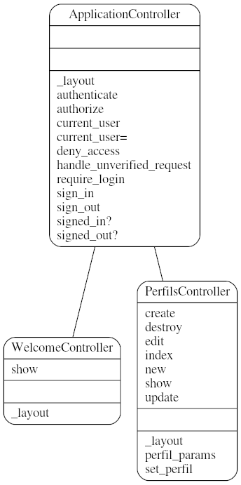

# EP-3 : Dicas de Academia

Este README irá descrever as funcionalidades do nosso site

<h3>Mas antes...<h3>

Ao fazer clone na branch master e dar "rails s" o terminal pode reclamar muito provavelmente da falta do yarn na sua pasta. Caso ele reclame siga as intruções do terminal que ira pedir para usar o comando "yarn install". Após isso tente dar rails s mais uma vez.

No seu browser após acessar o seu local host o site pode reclamar da migração. Faça a migração necessaria, descrita no proprio site, ou simplesmente aperte o botão de fazer a migração, támbem no próprio site. Agora, se tudo der certo, o site estará funcionando

<h2>Funcionalidades<h2>
* 
O nosso site possui dois tipos de pessoas os que possuem uma conta e os que não possuem uma conta:

	
Os que não estão possuem uma conta terão acesso apenas à pagina inicial com imformações a respeito do site. Sendo a mesma responsável por fazer o login dos usuários.

	
Os que possuem uma conta poderam fazer login na página inicial. Após o login ter sido efeituado, o usuário terá acesso à customização do seu perfil que será necessário para receber suas dicas.

* 
Perfil:

	
O perfil só pode ser editado(dados ficticios serão aceitos) após o usuário ter "logado" no site. Nele voce digita sua idade, altura, sexo, objetivo(marca a opção desejada), atividade(marca a opção desejada) e Atividade(ativo ou não ativo). O perfil é essencial para suas dicas serem geradas.

* 
Dicas:

	
As dicas que também já foram predefinidas serão escolhidas automaticamente após os dados do seu perfil terem sido preenchidos.

* 
UML:

	
MODELS:

		

	
CONTROLLERS:

		
		
